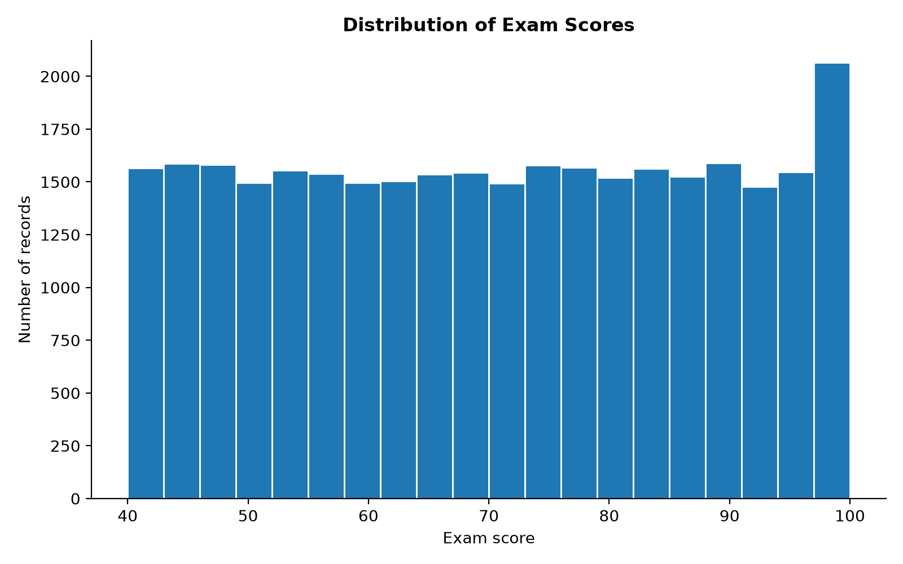
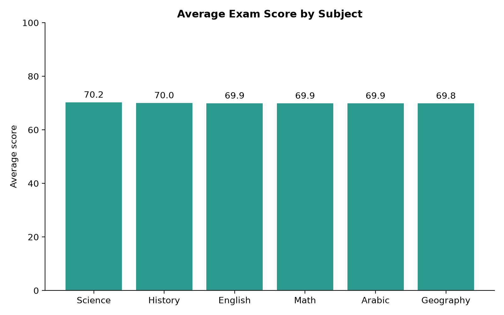
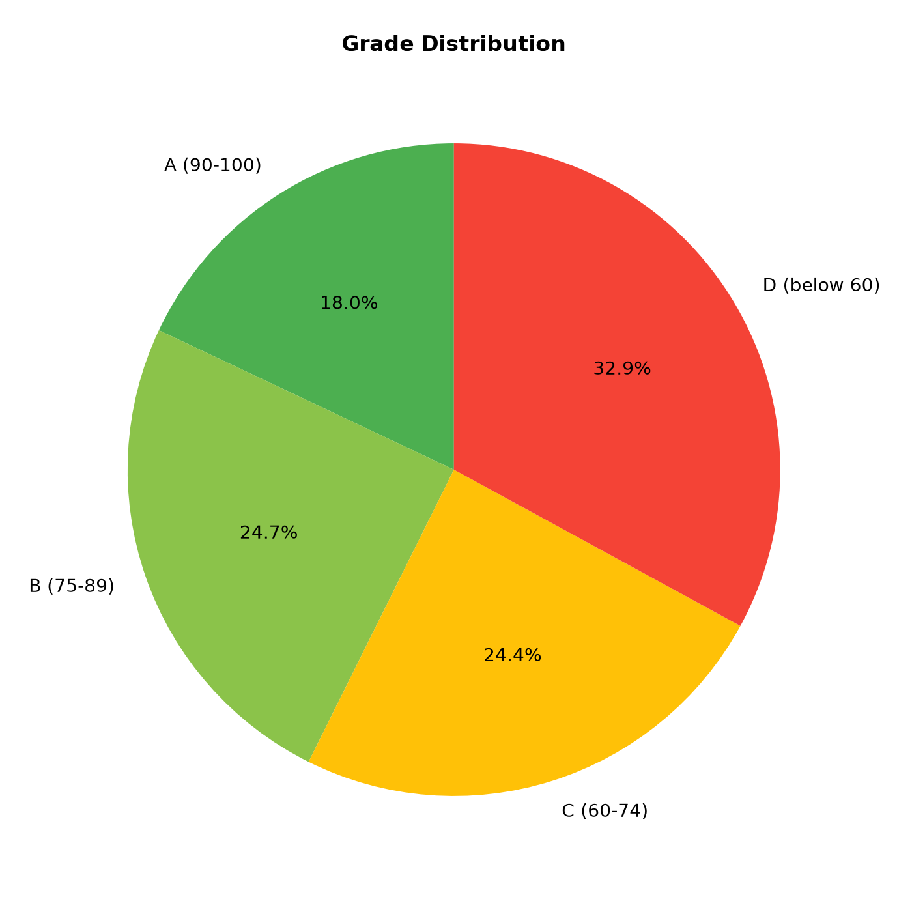
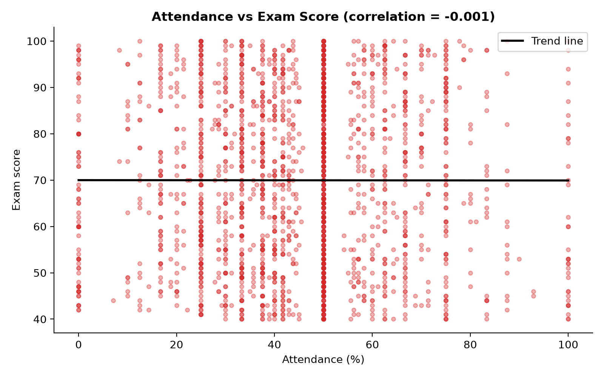
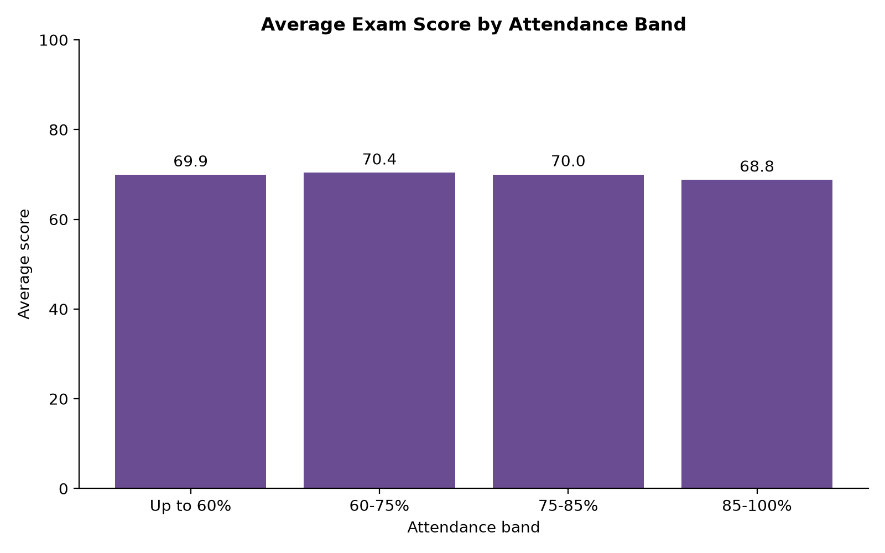

# Student Performance Analysis

A data analytics project that studies student exam scores, homework completion and attendance across six subjects, and checks whether attendance is related to academic performance.

Built for **Cognevance Technologies, Level 1 (Easy)**.

## Tools Used
- Python (Pandas, NumPy, Matplotlib)
- GitHub

## Dataset
Student performance data from Kaggle, with three files used in this project:

| File | Contents |
|---|---|
| `performance.csv` | Exam score and homework completion per student and subject (36,468 rows) |
| `attendance.csv` | Daily attendance status per student and subject (364,680 rows) |
| `students.csv` | Student details |

## Workflow
1. **Load** the raw data.
2. **Clean the data:**
   - Fixed messy attendance text (extra spaces, upper and lower case, the typo `absnt`).
   - Removed the `%` sign from homework values and replaced invalid values (`-5`) with the median.
   - Removed exam scores above 100, since they are invalid (5,139 rows).
3. **Calculate attendance %** for every student and subject (Present = 1, Late or Excused = 0.5, Absent or Left early = 0).
4. **Merge** performance and attendance data.
5. **Analyse** scores, grades, subjects, attendance and homework.
6. **Create charts** and save the cleaned dataset.
7. **Write the report** with insights and recommendations.

## Key Results
- **31,329** valid records remained after cleaning.
- The average exam score is about **70** out of 100.
- Grade split: A 18.0%, B 24.7%, C 24.4%, D 32.9%.
- All six subjects have almost the same average score (69.9 to 70.3).
- **Attendance and exam scores show no relationship** (correlation about 0).
- **Homework completion and exam scores show no relationship** (correlation about 0).

The full findings, recommendations and limitations are in [report.md](report.md).

## Charts

| | |
|---|---|
|  |  |
|  |  |



## Project Structure
```text
cognevance_student_performance_analysis/
├── README.md
├── report.md
├── main.py
├── students.csv
├── performance.csv
├── attendance.csv
├── charts/
│   ├── 1_exam_score_histogram.png
│   ├── 2_average_score_by_subject.png
│   ├── 3_grade_distribution_pie.png
│   ├── 4_attendance_vs_score_scatter.png
│   └── 5_score_by_attendance_band.png
└── output/
    ├── cleaned_student_performance.csv
    └── summary.txt
```

## How to Run
1. Install the libraries: `pip install pandas numpy matplotlib`
2. Keep `main.py` and the three CSV files (`students.csv`, `performance.csv`, `attendance.csv`) in the same folder.
3. Run: `python main.py`
4. Charts are saved in `charts/` and the cleaned data and summary in `output/`.

## Limitations
- The dataset shows no relationship between attendance and scores, which suggests it may be synthetic, so the results should not be applied to real schools.
- The attendance weights (0.5 for Late and Excused) are project assumptions.
